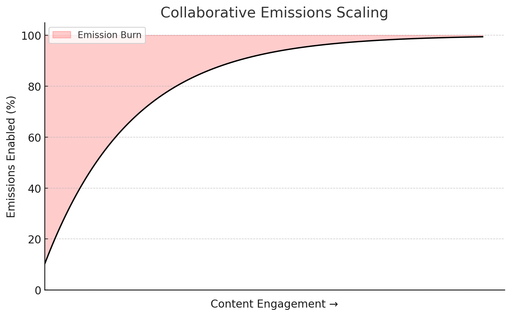

  

# Bitcast — The Decentralized Creator Economy

Bitcast is a decentralized platform that incentivizes content creators to connect brands with audiences. Creators publish YouTube videos to satisfy defined briefs and earn rewards based on engagement metrics.

---

## ⚙️ High-Level Architecture

- **Miners**: Produce and publish YouTube content for one or more briefs.  
- **Validators**: Obtain temporary OAuth tokens to securely access YouTube Analytics and validate performance.  
- **Brands**: Define and publish content briefs (initially focused on the Bittensor ecosystem).  
- **Briefs Server**: Hosts the [active briefs](https://www.dashboard.bitcast.network/briefs).  
- **Bittensor Network**: Manages on-chain compensation, disbursing Bitcast alpha tokens from Validators to Miners.

---

## 🚀 Getting Started

### For Miners

1. **Review Requirements**  
   Ensure your YouTube account and videos meet the [minimum requirements](bitcast/miner/README.md).

2. **Publish Content**  
   Create videos targeting one or more active briefs.

3. **Earn Rewards**  
   Videos that satisfy briefs are ranked by **total minutes watched**, and rewards are distributed evenly across briefs.

See the [Miner Setup Guide](bitcast/miner/README.md) for:
- Installation and configuration  
- OAuth and account integration  
- Miner registration on the network  
- Reward tracking and monitoring

### For Validators

Validators maintain the integrity of the network by:
- Retrieving analytics data via OAuth  
- Verifying content engagement  
- Disbursing on-chain rewards to Miners

Refer to the [Validator Setup Guide](bitcast/validator/README.md) for detailed instructions.

---

## 📊 Scoring Mechanism

The Bitcast network employs a sophisticated scoring and rewards system:

- **Performance Metrics**
  - Miners are evaluated using a 7-day moving average of minutes watched
  - Only videos matching active content briefs are considered
  - Analytics data includes a 2-day validation period aligned with YouTube's engagement verification, miners will not recieve emissions for the first 2 days after launch

- **Emissions Model**
  - Each content brief is allocated an equal proportion of total emissions
  - A briefs total available emissions will scale with overall engagement
  - Unused emissions are automatically burned via the burn UID

### Collaborative Emissions Scaling

During the initial launch phase, we are experimenting with a novel approach to emissions scaling. This system transforms what would be a zero-sum reward mechanisms into a dynamic model where miners benefit from both individual and collective network growth. As total engagement increases for a content brief, the percentage of total available emissions increases. Whatever is not released to miners is burnt.

The rate of emissions change will be carefully monitored and adjusted during the first few months post-launch, allowing us to optimize the system based on real-world performance data.

  

---

## 🤝 Contact & Support

For assistance or questions, join our Discord support channel:

[Bitcast Support on Bittensor Discord](https://discord.com/channels/799672011265015819/1362489640841380045)
